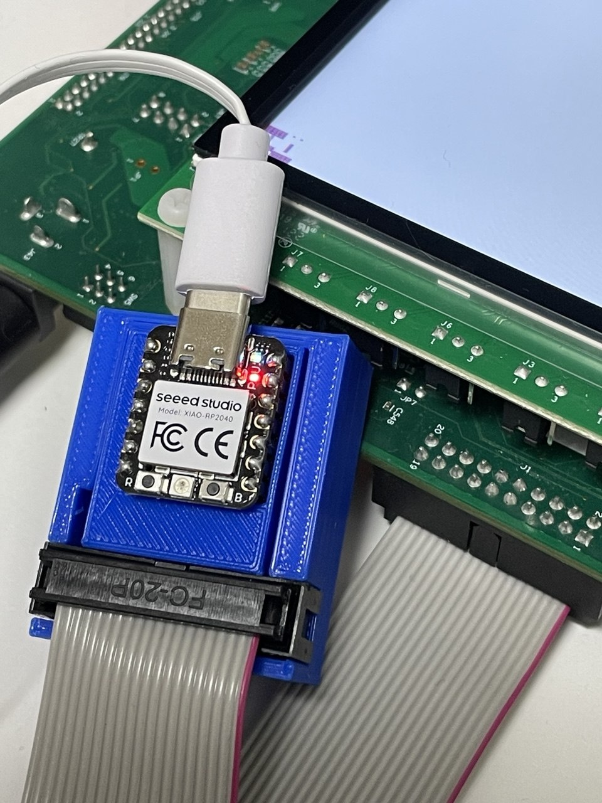
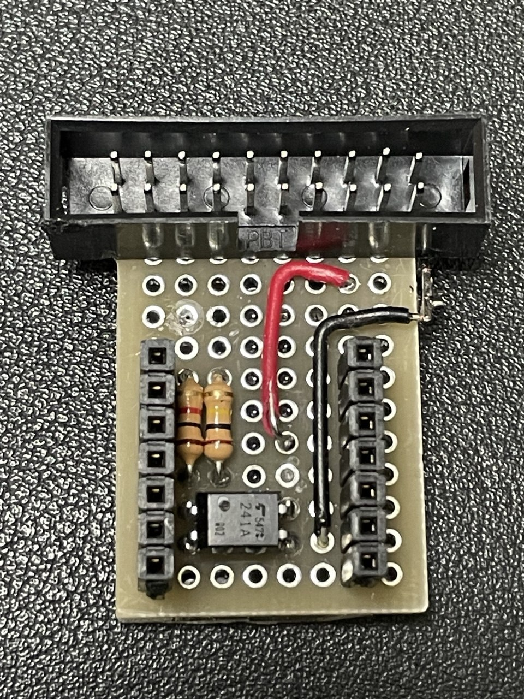
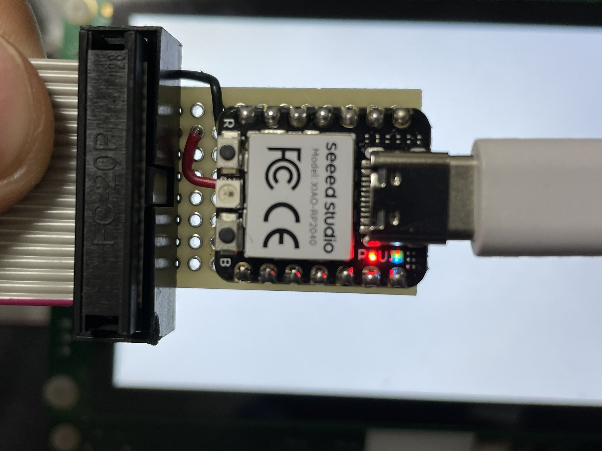
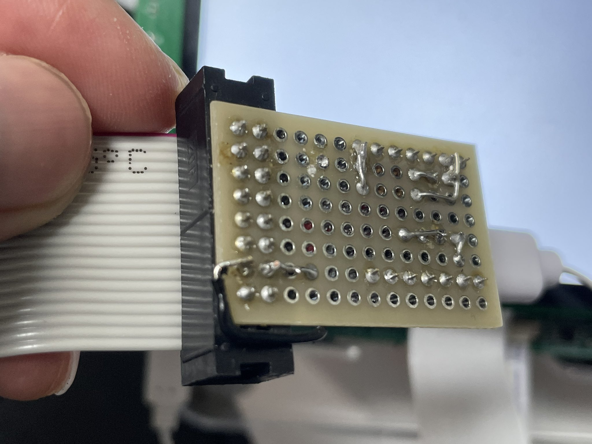
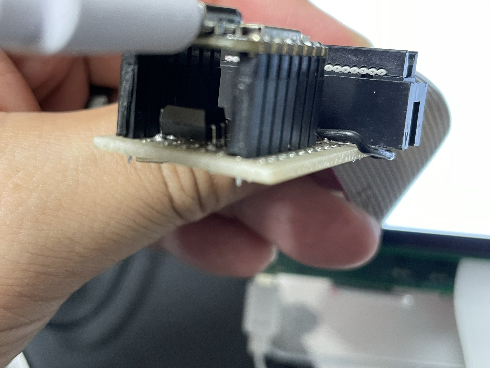
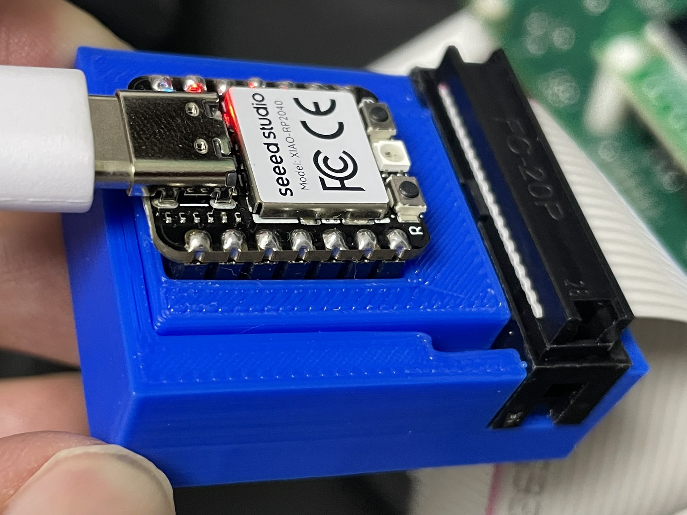

# USB JTAG Reset Dongle for MIMXRT1170-EVKB



## 目次

1. [目的](#1-目的)
2. [採用した方式](#2-採用した方式)
3. [ハードウェア構成](#3-ハードウェア構成)(うち [フォトリレーとは](#フォトリレーとは))
4. [回路図](#4-回路図)
5. [抵抗の意味](#5-抵抗の意味)
6. [ユニバーサル基板レイアウト](#6-ユニバーサル基板レイアウト)(実機写真は [§6 実機写真](#実機写真) 参照)
7. [Rust ファームウェア方針](#7-rust-ファームウェア方針)
8. [動作確認項目](#8-動作確認項目)

ソースとアセット:

- ファームウェア: [`software/firmware/`](software/firmware/) (RP2040 Rust)
- ホスト CLI: [`software/cli/`](software/cli/) (`rt1170-cli`)
- 3D プリントケース: [`hardware/case/`](hardware/case/)
- 写真: [`hardware/photos/`](hardware/photos/)
- 仕様書(USDM): [`spec/usdm/`](spec/usdm/)

---

## 1. 目的

**最終目標**: AI コーディングエージェント([Claude Code](https://www.anthropic.com/claude-code) 等)が [MIMXRT1170-EVKB](https://www.nxp.com/design/design-center/development-boards-and-designs/i-mx-evaluation-and-development-boards/i-mx-rt1170-evaluation-kit:MIMXRT1170-EVKB) を使った組み込み開発を行う際、デバッガや SDK が **「SW4 を押してください」「ボードをリセットしてください」**と要求する場面を、AI 自身が `rt1170-cli reset` を呼ぶだけで自動化すること。人間がリセットボタンを押すまでループが止まる、という制約から AI を解放する。

そのために、MIMXRT1170-EVKB を Linux PC から USB 経由でリセットできる小型治具を作る。

当初は [SwitchBot](https://www.switch-bot.com/) のように物理的にタクトスイッチを押す案も検討したが、対象が基板上の SMD タクトスイッチであり、グラバーや物理押下機構が現実的でないため、最終的には **JTAG/SWD 20pin コネクタ上の reset 信号を電気的に短絡する方式**を採用する。

MIMXRT1170-EVKB の Hardware User Guide([NXP MIMXRT1170-EVKB ドキュメントページ](https://www.nxp.com/design/design-center/development-boards-and-designs/i-mx-evaluation-and-development-boards/i-mx-rt1170-evaluation-kit:MIMXRT1170-EVKB))では、J1 の JTAG/SWD コネクタに `POR_PIN_RST_B` が `JTAG_nSRST` として出ている。したがって、JTAG 20pin の `nSRST` と `GND` を一瞬短絡すれば、リセットボタン (**SW4**) を押したのと同等の操作ができる。

基本動作:

```text
Linux PC
  |
  | USB
  v
XIAO RP2040
  |
  | GPIO
  v
TLP241A PhotoMOS
  |
  | output contact
  v
JTAG nSRST / POR_PIN_RST_B  ── GND
```

Linux 側からは、例えば以下のように操作する。

```bash
echo "RESET 100" > /dev/ttyACM0
```

これにより、XIAO RP2040 が TLP241A を 100 ms だけ ON し、JTAG `nSRST` を GND に短絡する。

---

## 2. 採用した方式

### 最終方式

**USB CDC + XIAO RP2040 + TLP241A + 20pin JTAG IDC ケーブル**

### 採用理由

- MIMXRT1170-EVKB 側の SMD タクトスイッチを直接触らずに済む
- EVKB 側を改造しなくてよい
- JTAG/SWD 20pin コネクタから `nSRST` と `GND` を取り出せる
- TLP241A により XIAO 側と EVKB 側を絶縁できる
- Linux から `/dev/ttyACM0` 経由で簡単に制御できる
- XIAO RP2040 が手元にあり、Rust ファームウェアを書きやすい
- 13×8 の小型ユニバーサル基板に実装可能

---

## 3. ハードウェア構成

### フォトリレーとは

**フォトリレー**(PhotoMOS, [ソリッドステートリレー (SSR)](https://en.wikipedia.org/wiki/Solid-state_relay) の一種)は、光結合で入力と出力を電気的に絶縁したスイッチ。内部構造はおおよそ次のとおり:

- **入力側**: LED(発光ダイオード)
- **出力側**: MOSFET(機種により SCR や Triac のものもある)
- **絶縁**: LED と MOSFET の間は **光のみ**で結合。電気的には完全に分離されている

LED に電流を流して点灯させると、その光を受けた MOSFET がオンになり、出力側の接点が導通する。LED を消せばオフ。機械式リレーと違ってバウンスがなく、寿命が長く、スイッチング速度も速い。

このプロジェクトで採用している [**TLP241A**](https://akizukidenshi.com/goodsaffix/TLP241A_datasheet_ja_20230524.pdf)(東芝)は、出力 MOSFET が **双方向**(AC/DC どちらも切れる)、耐圧 60 V、`I_FT(max) = 5 mA` でトリガする 1 回路品。DIP-4 パッケージ。

### 主要部品

| 部品 | 用途 |
|---|---|
| [XIAO RP2040](https://wiki.seeedstudio.com/XIAO-RP2040/) | USB CDC デバイス兼 GPIO 制御 |
| [TLP241A](https://akizukidenshi.com/goodsaffix/TLP241A_datasheet_ja_20230524.pdf) | JTAG `nSRST` と `GND` を短絡する PhotoMOS / [フォトリレー](#フォトリレーとは) |
| 20pin IDC フラットケーブル | MIMXRT1170-EVKB の J1 JTAG/SWD コネクタへ接続 |
| 20pin 2×10 ヘッダ / IDC 受け | ユニバーサル基板側で IDC ケーブルを受ける |
| 13×8 ユニバーサル基板 | 実装基板 |
| 1kΩ 抵抗 | TLP241A 入力 LED の電流制限 (詳細は [§5](#5-抵抗の意味)) |
| 100kΩ 抵抗 | XIAO GPIO のプルダウン (詳細は [§5](#5-抵抗の意味)) |
| ピンソケット | XIAO RP2040 を着脱可能にする |

### 使用する信号

#### JTAG 20pin 側

一般的な ARM 20pin JTAG/SWD 配置では以下を使う。

```text
pin15 = nSRST / JTAG_nSRST / POR_PIN_RST_B
pin16 = GND
```

したがって TLP241A の出力側で以下を短絡する。

```text
JTAG pin15  <->  JTAG pin16
```

#### XIAO RP2040 側

XIAO は USB-C が下向きになるように配置する。  
制御ピンは、配置しやすい **D7 / GPIO1** を採用する。

```text
XIAO D7 / GPIO1 -> TLP241A input LED+
XIAO GND        -> TLP241A input LED-
```

---

## 4. 回路図

### 全体回路

TLP241A を中央に置き、**左半分が XIAO 側(LED 入力, 3.3V GND 系)**、**右半分が EVKB 側(MOSFET 出力, EVKB GND 系)**。チップ内部で光結合だけが両者をまたぎ、電気的には絶縁されている。

```text
   XIAO RP2040 側                  TLP241A                    EVKB J1 (JTAG 20pin)
   ─────────────                  ─────────                   ─────────────────────

                                ┌──────────┐
   D7/GPIO1 ●─┬─[ R1  1kΩ ]─────┤ 1      4 ├────────── ● pin 16 (GND, EVKB 側)
              │                 │  │     ║ │
              │                 │  ▼ LED ║ MOSFET   ← LED 点灯時に MOSFET 閉
              │                 │  │     ║ │
              └─[ R2 100kΩ ]──┐ │  │     ║ │
                              │ │  │     ║ │
   XIAO GND ●─────────────────●─┤ 2      3 ├────────── ● pin 15 (nSRST)
                                └──────────┘
                                  ◀────│────▶
                                  入力  │  出力
                                  (LED) │  (MOSFET)
                                        │
                                   絶縁境界(光結合のみ)
```

- pin 1, 2(チップ左) は XIAO 側 GND を基準とした 3.3V 系
- pin 3, 4(チップ右) は EVKB 側 GND を基準とした JTAG 信号
- 両 GND は同電位ではなく、TLP241A 内部で**完全に絶縁**されている

### JTAG 側

```text
MIMXRT1170-EVKB J1 / JTAG 20pin

pin15  nSRST / POR_PIN_RST_B  ---- TLP241A pin3
pin16  GND                    ---- TLP241A pin4
```

### XIAO 側

```text
XIAO D7 / GPIO1  ---- R1 1kΩ ----- TLP241A pin1
XIAO GND         ----------------- TLP241A pin2

XIAO D7 / GPIO1  ---- R2 100kΩ ---- XIAO GND
```

---

## 5. 抵抗の意味

### R1

TLP241A の入力 LED に流れる電流を制限するための抵抗。

- 推奨: **470Ω**
- 採用: **1kΩ**

### R2: 100kΩ

XIAO の GPIO が起動直後やリセット中に浮いて、TLP241A が誤 ON するのを防ぐためのプルダウン抵抗。

```text
XIAO D7/GPIO1 ---- 100kΩ ---- XIAO GND
```

---

## 6. ユニバーサル基板レイアウト

### 前提

- 基板: 13×8 ユニバーサル基板
- ポートレート配置
- 幅 8 穴 × 高さ 13 穴
- 20pin IDC は上側
- XIAO RP2040 は行7〜13
- XIAO は USB-C が下向き
- 20pin IDC は 8穴幅に対して左右 1 ピンずつはみ出す
- 抵抗は TLP241A の左側に置く

### 配置図

13×8 ユニバーサル基板 / 部品面・上から見る(USB-C を下、IDC を上にして縦置き):

部品面(XIAO 未装着、配線とパーツが全部見える):



|   |   | 1 | 2 | 3 | 4 | 5 | 6 | 7 | 8 |   |  |
|:-:|:-:|:-:|:-:|:-:|:-:|:-:|:-:|:-:|:-:|:-:|:-:|
|   |   |   |   |   |   |   |   | ┌ | ─ | ─ | ┐ |
| r1 | ① | ③ | ⑤ | ⑦ | ⑨ | ⑪ | ⑬ | **⑮** | ⑰ | ⑲ | │ |
| r2 | ② | ④ | ⑥ | ⑧ | ⑩ | ⑫ | ⑭ | **⑯** | ⑱ | ⑳ | │ |
| r3 |   | ・ | ・ | ・ | ・ | ・ | ・ | │ | ・ |   | │ |
| r4 |   | ・ | ・ | ・ | ・ | ┌ | ─ | ┘ | ・ |   | │ |
| r5 |   | ・ | ・ | ・ | ・ | │ | ┌ | ─ | ─ | ─ | ┘ |
| r6 |   | ・ | ・ | ・ | ・ | │ | │ | ・ | ・ |   |   |
| r7 |   | 7️⃣ | ┬ | ┐ | ・ | │ | │ | 6️⃣ | ・ |   |   |
| r8 |   | 8️⃣ | Ｒ | Ｒ | ・ | │ | │ | 5️⃣ | ・ |   |   |
| r9 |   | 9️⃣ | １ | ２ | ・ | │ | │ | 4️⃣ | ・ |   |   |
| 10 |   | 🔟 | │ | │ | ・ | │ | │ | 3️⃣ | ・ |   |   |
| 11 |   | 🔌 | P1 | │ | □ | P3 | │ | 2️⃣ | ・ |   |   |
| 12 |   | ➖ | -2 | ┘ | □ | P4 | ┘ | 1️⃣ | ・ |   |   |
| 13 |   | ➕ | ・ | ・ | ・ | ・ | ・ | 0️⃣ | ・ |   |   |
|   |   |   |   | Ｕ | Ｓ | Ｂ |   |   |   |   |   |

凡例:

- `①`〜`⑳` … IDC ピン番号(囲み数字)。`⑮` (pin 15 = nSRST) と `⑯` (pin 16 = GND) のみ太字
- `・` … 空のホール
- `0️⃣`〜`9️⃣` `🔟` … XIAO の D0〜D10 ピン穴(囲み数字キーキャップ絵文字)
- `🔌` … 3V3、 `➖` … GND、 `➕` … 5V
- `Ｒ` `Ｒ` … R1 (1kΩ) / R2 (100kΩ) 本体、 `１` `２` … 抵抗ラベル
- `□` … TLP241A のチップ本体、 `P1`〜`P4` … 各ピン
- `┌` `┐` `┘` `─` `│` `┬` … 配線(IDC 渡り線、D7 分岐、R 末端ジャンパ)

XIAO ピン配置(USB-C を下向きにした縦置き、部品面・上から見る):

- **左ソケット**(行6→12): **D7/GPIO1**, D8, D9, D10, 3V3, **GND**, 5V
- **右ソケット**(行6→12): D6, D5, D4, D3, D2, D1, D0

レイアウト要点:

- R1 / R2 は左ソケット直右に縦置き 2 本、どちらも D7/GPIO1 から分岐
- TLP241A は基板中央、**左半分が LED 入力**(XIAO 側 GND を基準)、**右半分が MOSFET 出力**(EVKB 側 GND を基準)
- IDC の渡り線 2 本は中央 trench を縦に走り、TLP241A 右側の P3, P4 へ降下
- XIAO 側 GND と JTAG GND(EVKB 側)は TLP241A 内部で絶縁(直結なし)

### 穴位置(主要ホール)

```text
IDC pin15 (nSRST)       = 行1, 列7        ※ IDC は左右各 1 ピンずつ overhang
IDC pin16 (GND, EVKB側) = 行2, 列7

XIAO D7/GPIO1           = 行6, 列2  (左ソケット最上段)
XIAO GND                = 行11, 列2 (左ソケット下から 2 行目)

TLP241A pin1 (LED+)     = 行10, 列3
TLP241A pin2 (LED−)     = 行11, 列3
TLP241A pin3 (MOSFET)   = 行10, 列6
TLP241A pin4 (MOSFET)   = 行11, 列6
```

配線:

```text
行1列7  IDC pin15 / nSRST   ─── (中央 trench を縦走) ─── 行10列6  TLP241A pin3
行2列7  IDC pin16 / GND     ─── (中央 trench を縦走) ─── 行11列6  TLP241A pin4

行6列2   XIAO D7/GPIO1 ─┬── R1 1kΩ ───────────────────  行10列3  TLP241A pin1
                       └── R2 100kΩ ──┐
                                       │
行11列2 XIAO GND ─────────────────────●─────────────────  行11列3  TLP241A pin2
```

### 実機写真

部品面(XIAO 装着済):



はんだ面(基板裏のジャンパ配線):



側面(TLP241A・IDC・XIAO の位置関係):



3D プリントケース組み込み済:



---

## 7. Rust ファームウェア方針

XIAO RP2040 は USB CDC デバイスとして動作させる。  
Linux からは `/dev/ttyACM0` として見える。

### コマンド仕様

```text
PING
RESET
RESET 100
OFF
```

### 動作

```text
PING       -> PONG
RESET      -> D7/GPIO1 を 100 ms High
RESET 100  -> D7/GPIO1 を 100 ms High
OFF        -> D7/GPIO1 を Low
```

RESET 時:

```text
XIAO D7 High
  -> TLP241A input LED ON
  -> TLP241A output ON
  -> JTAG pin15-pin16 short
  -> MIMXRT1170-EVKB reset
```

安全策:

```text
起動時は必ず D7 Low
RESET時間に上限を設ける
不正コマンドでは何もしない
OFFコマンドを用意する
```

---

## 8. 動作確認項目

EVKB に接続する前に必ず確認する。

### 通常時

```text
JTAG pin15 - pin16 = 非導通
```

### RESET 実行時

```text
JTAG pin15 - pin16 = 一瞬だけ導通
```

### 絶縁確認

```text
XIAO 5V  - JTAG側 = 非導通
XIAO 3V3 - JTAG側 = 非導通
XIAO GND - JTAG GND = 非導通
```

TLP241A を使うため、XIAO 側 GND と EVKB/JTAG 側 GND は直結しない。

---


